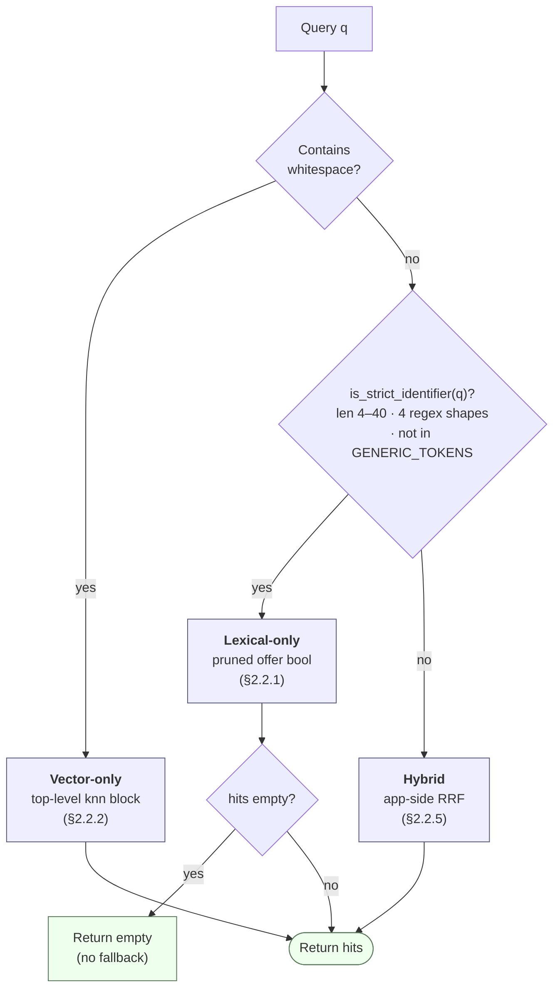
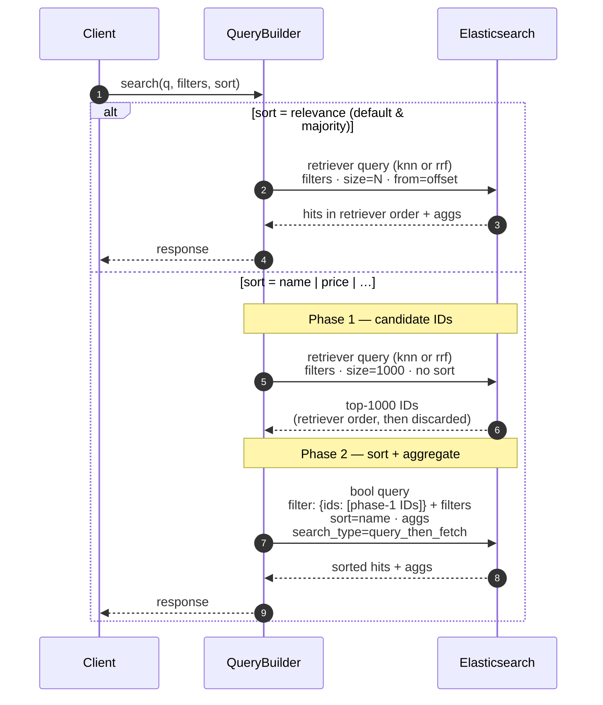
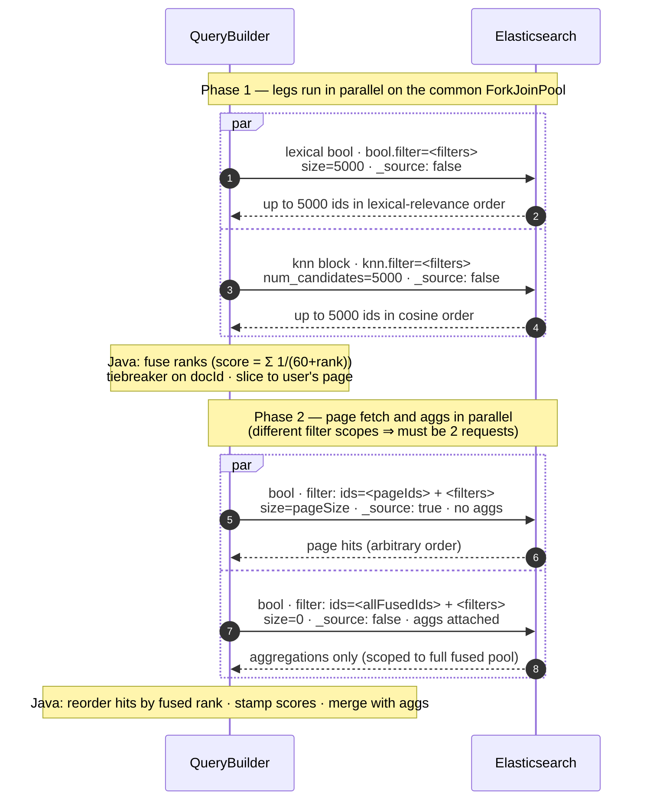
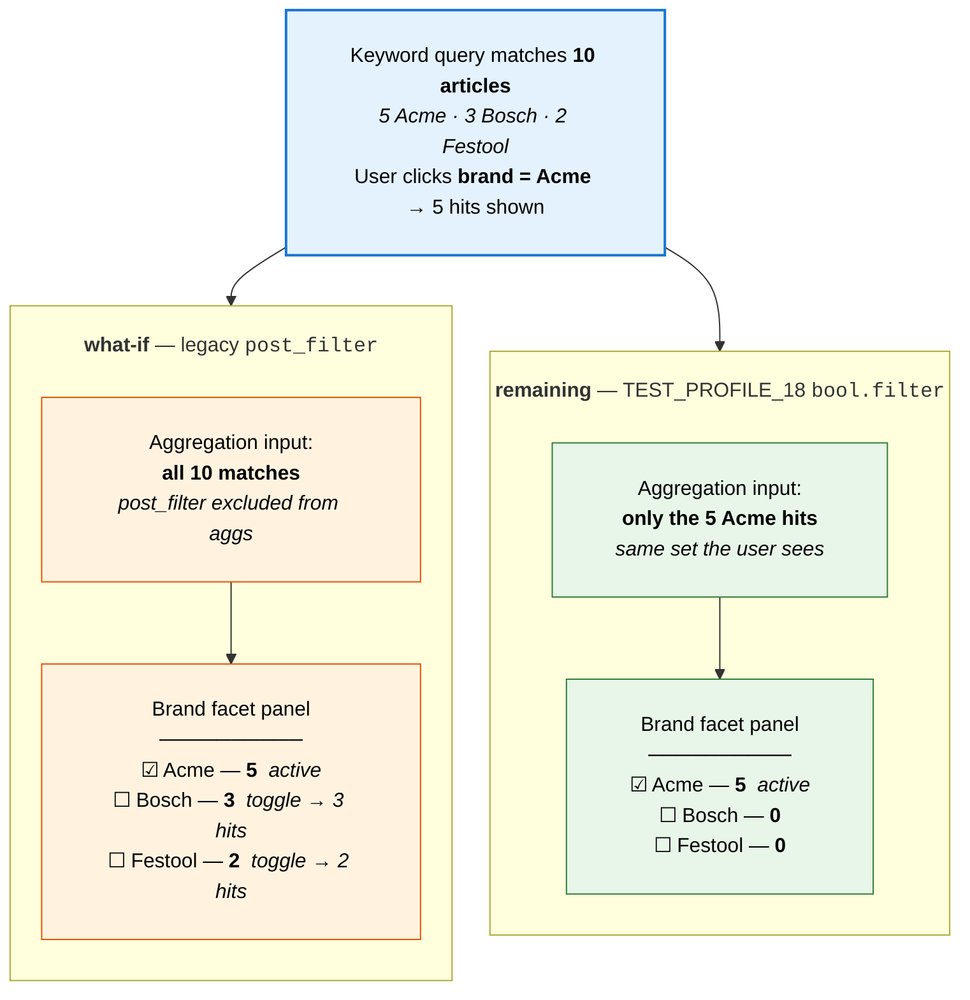
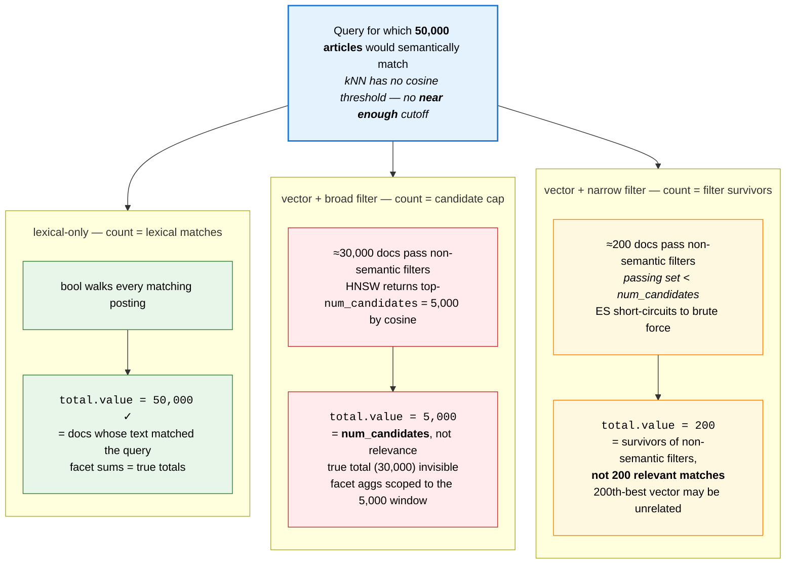
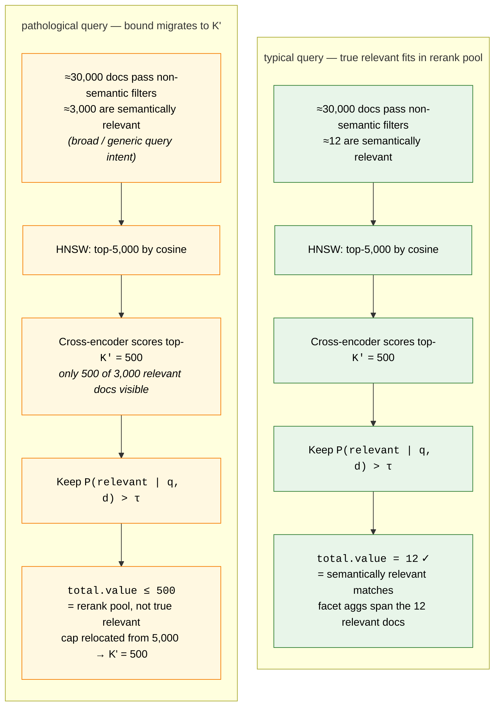

# 1. Status quo

The existing (pre-fine-tuned) search stack: the index mapping (§1.1), the STANDARD profile (§1.2), and the shared query-builder infrastructure that surrounds both (§1.3). The §2 target is additive on top of this — it adds fields to the index and a new query path while leaving STANDARD fully functional.

## 1.1 Index mapping: `stg-article-index-v1` (staging — authoritative)

Source: live mapping at `${ELASTIC_NONPROD_URL}/stg-article-index-v1/_mapping`, alias pointing at concrete index `stg-article-index-v1-20260423183222` on cluster `nonprod` (ES 9.3.3, Lucene 10.3.2).

Index settings of note: `number_of_shards: 32`, `number_of_replicas: 1`, `refresh_interval: 3s`, `mapping.nested_objects.limit: 20000`. All custom analyzers/normalizers expected by the mapping (`article_number_*`, `german_*`, `ean_search`, `sort_normalizer`, `lowercase_normalizer`, …) are pre-declared in `index.analysis`.

The document is an **article** at the top level with three large nested object groups (`customerArticleNumbers`, `offers`, `prices`) plus a handful of top-level scalars. Nested means each child is indexed as its own hidden Lucene document — queries against them must use `nested` clauses. **No embedding fields exist on staging today** — they are the additions covered in §2.1.

### 1.1.1 Top-level article fields

| Field | Type | Notes |
|---|---|---|
| `_class` | `keyword` | Internal type marker; not indexed, no doc_values |
| `articleId` | `keyword` | Primary identifier |
| `articleNumber` | `keyword` | No doc_values, no multi-fields at this level (the searchable variants live on `offers.articleNumber`) |
| `vendorId` | `keyword` | |
| `updatedAt` | `date` | `date_optional_time` or `epoch_millis` |
| `enabledCoreArticleMarkerSources` | `keyword` | |
| `disabledCoreArticleMarkerSources` | `keyword` | |
| `syntheticKeywords` | `text` (analyzer `german_stemmed`) | Multi-fields: `.de2` and `.de_v2` (both `german_strict`). Used by STANDARD's synthetic-keywords sub-query |

### 1.1.2 Nested: `customerArticleNumbers`

One entry per customer-managed mapping (a customer's own SKU for an article).

- `value` — `keyword` with rich multi-fields for partial and segmented matching:
  - `.normalized` — `article_number_normalized`
  - `.partial` — index `article_number_normalized_partial`, search `article_number_normalized`
  - `.prefix` — index `article_number_normalized_incremental`, search `article_number_normalized`
  - `.raw` — `article_number_keyword`
  - `.seg` — `article_number_segments_analyzer`
- `versionIds` — `keyword`, no doc_values. Used to scope queries to specific customer source lists.
- `_class` — internal marker.

### 1.1.3 Nested: `offers`

The richest group — one entry per offer (vendor + price-list combination) for the article.

Identifier-like fields (all use the article-number multi-field pattern `raw / normalized / partial / prefix / seg`):

- `articleNumber` — `keyword`, `ignore_above: 75`, `sort_normalizer`, plus the multi-fields above
- `manufacturerArticleNumber` — `keyword`, no doc_values, plus the multi-fields above
- `ean` — `text` (analyzer `article_number_analyzer_starts_with`), `.raw` uses `standard` index + `ean_search` query analyzer

Free-text fields:

- `name` — `keyword` (sortable, `ignore_above: 75`), plus:
  - `.de3` — `german_text_decompounded` (decompounded German)
  - `.de_joined` — index `german_strict_joined`, search `german_strict`
  - `.de_strict` — `german_strict`
- `manufacturerName` — `keyword`, `.de2` (index `german_company`, search `german_strict`)
- `vendorName` — `keyword`, `.de2` (index `german_company`, search `german_strict`)
- `keywords` — `text` (`german_stemmed`), `.de2` (`german_strict`)

Catalog / classification:

- `categoryPaths` — object with `upToLevel1` … `upToLevel5`, all `keyword`
- `eclass51Groups`, `eclass71Groups` — `keyword`
- `s2classGroups` — `keyword`
- `catalogVersionIds` — `keyword`

Relations and flags:

- `similarTo`, `accessoryFor`, `sparePartFor` — `keyword`, no doc_values
- `offerCoordinates` — `keyword`, no doc_values
- `deliveryTime` — `integer`, no doc_values

Nested-within-nested:

- `features` — nested, with `name` (`keyword`) and `values` (`keyword`)

### 1.1.4 Nested: `prices`

- `currency` — `keyword`
- `price` — `float`
- `priceListId`, `priority` — `keyword`, no doc_values
- `importEpoch` — `long`

## 1.2 STANDARD search profile

Source: `StringQueryProviderFactory.java` (`STANDARD` case) → `StandardStringQueryProvider.java`. The factory entry:

```java
case STANDARD, TEST_PROFILE_02 -> {
  return new StandardStringQueryProvider(
      queryString,
      customerArticleNumbersListVersionIds,
      customerUploadedArticleNumberSourceId,
      uiCustomerArticleNumberSourceId,
      false,                                  // useDecompounding
      syntheticKeywordsProperties.getBoost(),
      syntheticKeywordsProperties.getAnalyzer());
}
```

`STANDARD` is `useDecompounding = false`. (`TEST_PROFILE_01` is the same provider with `useDecompounding = true`, which adds one extra clause — covered in §1.2.4.)

The provider produces **three independent sub-queries**, each returned as an `Optional<Query>`; callers combine them at a higher level (typically a `bool` `should` aggregation):

1. `offerQuery()` — main text/identifier scoring, wrapped at call site in a `nested` over `offers`.
2. `customerArticleNumberQuery()` — match on the caller's customer-managed numbers, scoped by version IDs.
3. `syntheticKeywordsQuery()` — boost on the article's synthetic keyword field.

Boost constants used below:

```
HIGHEST_BOOST = 99
HIGHER_BOOST  = 75
HIGH_BOOST    = 50
MIDDLE_BOOST  = 30
```

### 1.2.1 Offer query — `offerQuery()`

A `bool` with `should` clauses, **always** including the following (with `useDecompounding = false`):

**(a) Cross-fields multi_match across offer text — `boost: 99`**

```json
{
  "multi_match": {
    "query": "<user input>",
    "fields": [
      "offers.articleNumber.seg^5",
      "offers.name.de_joined^5",
      "offers.name.de_strict^3",
      "offers.manufacturerName.de2^2",
      "offers.vendorName.de2^2",
      "offers.keywords.de2^1"
    ],
    "type": "cross_fields",
    "analyzer": "german_strict",
    "operator": "and",
    "tie_breaker": 1.0,
    "minimum_should_match": "100%",
    "fuzzy_transpositions": false,
    "auto_generate_synonyms_phrase_query": false,
    "boost": 99
  }
}
```

`cross_fields` treats the listed fields as one virtual field for term-frequency purposes; `tie_breaker: 1.0` effectively sums scores. `AND` + `100%` requires every query term to appear *somewhere* across the field group.

**(b) Article-number exact `.raw` — `boost: 50`**

```json
{
  "match": {
    "offers.articleNumber.raw": {
      "query": "<user input>",
      "operator": "or",
      "minimum_should_match": "1",
      "fuzziness": "0",
      "fuzzy_transpositions": false,
      "auto_generate_synonyms_phrase_query": false,
      "boost": 50
    }
  }
}
```

**(c) Article-number normalized — `boost: 50`** — same shape as (b) on `offers.articleNumber.normalized`.

**(d) Article-number segmented AND — `boost: 30`**

```json
{
  "match": {
    "offers.articleNumber.seg": {
      "query": "<user input>",
      "operator": "and",
      "minimum_should_match": "100%",
      "fuzziness": "0",
      "fuzzy_transpositions": false,
      "boost": 30
    }
  }
}
```

**(e) Manufacturer article-number `.raw` — `boost: 30`** — OR-match, fuzziness 0, on `offers.manufacturerArticleNumber.raw`.

**(f) Manufacturer article-number `.normalized` — `boost: 30`** — same shape on `offers.manufacturerArticleNumber.normalized`.

**(g) EAN `.raw` — `boost: 30`** — OR-match, fuzziness 0, on `offers.ean.raw`.

This sub-query is intended to be wrapped at the call site in `nested` with `path: "offers"`.

### 1.2.2 Customer article number query — `customerArticleNumberQuery()`

A `bool` with two `should` clauses on `customerArticleNumbers.value.raw` and `customerArticleNumbers.value.normalized`, both `MIDDLE_BOOST = 30`, OR-match, `fuzziness: 0`:

```json
{
  "bool": {
    "should": [
      { "match": { "customerArticleNumbers.value.raw":        { "query": "<q>", "operator": "or", "minimum_should_match": "1", "fuzziness": "0", "fuzzy_transpositions": false, "auto_generate_synonyms_phrase_query": false, "boost": 30 }}},
      { "match": { "customerArticleNumbers.value.normalized": { "query": "<q>", "operator": "or", "minimum_should_match": "1", "fuzziness": "0", "fuzzy_transpositions": false, "auto_generate_synonyms_phrase_query": false, "boost": 30 }}}
    ]
  }
}
```

That field-query is then wrapped by `QueryCustomerArticleNumberBuilder`, which scopes the match to the right source list. Three concrete shapes:

**Variant A — `uiCustomerArticleNumberSourceId` is set.** Score either a hit in the CUSTOM source, or a hit anywhere else *but only* when no CUSTOM mapping exists:

```json
{
  "bool": {
    "should": [
      {
        "nested": {
          "path": "customerArticleNumbers",
          "score_mode": "max",
          "query": {
            "bool": {
              "filter": [{ "term": { "customerArticleNumbers.versionIds": "<uiCustomerArticleNumberSourceId>" }}],
              "must":   [<fieldQuery>]
            }
          }
        }
      },
      {
        "bool": {
          "must_not": [
            {
              "nested": {
                "path": "customerArticleNumbers",
                "score_mode": "max",
                "query": { "bool": { "filter": [{ "term": { "customerArticleNumbers.versionIds": "<uiCustomerArticleNumberSourceId>" }}] }}
              }
            }
          ],
          "must": [ <defaultQuery(fieldQuery)> ]
        }
      }
    ]
  }
}
```

**Variant B — no UI source, `customerManagedArticleNumberSourceId` is set.** Prefer the customer-managed source; fall back to the other version IDs when no managed mapping exists:

```json
{
  "bool": {
    "should": [
      {
        "nested": {
          "path": "customerArticleNumbers",
          "score_mode": "max",
          "query": {
            "bool": {
              "filter": [{ "term": { "customerArticleNumbers.versionIds": "<customerManagedSourceId>" }}],
              "must":   [<fieldQuery>]
            }
          }
        }
      },
      {
        "bool": {
          "must_not": [
            {
              "nested": {
                "path": "customerArticleNumbers",
                "score_mode": "max",
                "query": { "term": { "customerArticleNumbers.versionIds": "<customerManagedSourceId>" }}
              }
            }
          ],
          "must": [
            {
              "nested": {
                "path": "customerArticleNumbers",
                "score_mode": "max",
                "query": {
                  "bool": {
                    "filter": [{ "terms": { "customerArticleNumbers.versionIds": [<orderedVersionIds...>] }}],
                    "must":   [<fieldQuery>]
                  }
                }
              }
            }
          ]
        }
      }
    ]
  }
}
```

**Variant C — neither UI nor managed source.** Simple nested match scoped to the version IDs preferred by the search context:

```json
{
  "nested": {
    "path": "customerArticleNumbers",
    "score_mode": "max",
    "query": {
      "bool": {
        "filter": [{ "terms": { "customerArticleNumbers.versionIds": [<orderedVersionIds...>] }}],
        "must":   [<fieldQuery>]
      }
    }
  }
}
```

### 1.2.3 Synthetic keywords query — `syntheticKeywordsQuery()`

```json
{
  "match": {
    "syntheticKeywords.de2": {
      "query": "<user input>",
      "analyzer": "<syntheticKeywordsProperties.analyzer>",
      "operator": "and",
      "boost": "<syntheticKeywordsProperties.boost>"
    }
  }
}
```

Analyzer and boost are configurable via `SyntheticKeywordsProperties`. The field path uses the `.de2` multi-field (the mapping also exposes a `.de_v2` — not used by this profile).

### 1.2.4 STANDARD vs. neighboring profiles

- **`STANDARD`** — exactly the three sub-queries above; `useDecompounding = false`. **No** clause on `offers.name.de3`.
- **`TEST_PROFILE_02`** — same provider, same args as `STANDARD`. Identical query.
- **`TEST_PROFILE_01`** — same provider with `useDecompounding = true`. Adds **one extra `should`** to the offer query:

  ```json
  {
    "match": {
      "offers.name.de3": {
        "query": "<user input>",
        "operator": "and",
        "minimum_should_match": "100%",
        "fuzziness": "0",
        "fuzzy_transpositions": false,
        "boost": 75
      }
    }
  }
  ```

  Routes through the `german_text_decompounded` analyzer for compound-word matching.
- **`STANDARD_PB`** — separate `StandardPbStringQueryProvider`; adds phrase-boost behavior and is not interchangeable with `STANDARD`.

## 1.3 Shared search infrastructure

Everything in §1.2 and §2.2 only covers the `StringQueryProvider` — the per-profile text query factory. The surrounding behavior (filtering, pagination, sorting, aggregations, etc.) lives in `SearchArticleQueryBuilder` and applies to **all legacy profiles**. Source paths below are relative to `article/search/query/src/main/java/.../infrastructure/search/`.

> **TEST_PROFILE_18 overrides §1.3.1, §1.3.4, and §1.3.6.** It collapses pre-filters and post-filters into a single filter list applied to both retrievers' filter slots (no `post_filter`); its aggregations produce remaining counts rather than what-if counts; and it drops `dfs_query_then_fetch` in favor of plain `query_then_fetch`. See §2.2.6 and §2.2.3 for the rationale and code consequences. The rest of §1.3 (sorting, pagination, source filtering, related-articles overlay, builder entry points) applies unchanged.

### 1.3.1 Filtering — pre-filters vs. post-filters

ES has two filter slots that look similar but behave very differently. The legacy builder uses both. **TEST_PROFILE_18 does not use `post_filter` at all** — see §2.2.6 for the divergence; everything below describes the legacy STANDARD / `TEST_PROFILE_*` behavior.

**Pre-filters** — added to the core query bool by `addPreFilters()` (line 201). These are folded into the **`bool.filter` of the main query**, so they constrain the candidate set *before* anything else runs. They're for filters that are structurally required and shouldn't appear as facets.

Pre-filter clauses always include:

- **Offers context** — `nested(path: "offers", score_mode: none, query: <OfferFilterBuilder>)`. Restricts which offers on each article are eligible (e.g. customer's catalog scope, active offers, ACL).
- **Prices context** — `nested(path: "prices", score_mode: none, query: <PriceListFilterBuilder>)`. Restricts to the price lists visible to the caller.
- Each filter provider's `buildPreFilterQuery()` output (most providers don't emit one; some do for hard scoping).
- **Catalog view core articles filter** — when a catalog view limits to its curated article set.
- **Catalog view blocked eClass filters** — eClass exclusions imposed by the catalog view.

**Post-filters** — assembled by `postFilters()` (line 216) and attached via `queryBuilder.withFilter(...)`, which lands on ES's top-level `post_filter`. Key property: **`post_filter` is applied to hits but NOT to aggregations**. That makes it the right slot for user-selected facet filters, because the facet histogram still shows all options even after the user has narrowed.

Post-filters come from each `SearchFilterProvider.buildPostFilterQuery()` and are recorded into an `EnumMap<SearchFilterKind, Query>` (`appliedFilters`) so aggregations can later subtract their own filter from their own bucket counts (the standard facet-counting trick).

The ten filter providers wired by `SearchFilterProvidersFactory`:

| Kind | Provider | Source field(s) |
|---|---|---|
| `VENDOR` | `VendorFilterProvider` | `vendorId` |
| `ARTICLE_ID` | `ArticleIdFilterProvider` | `articleId` |
| `MANUFACTURER` | `ManufacturerFilterProvider` | `offers.manufacturerName` |
| `PRICE` | `PriceFilterProvider` | `prices.price` (nested) |
| `DELIVERY_TIME` | `DeliveryTimeFilterProvider` | `offers.deliveryTime` |
| `FEATURES` | `FeaturesFilterProvider` | `offers.features.*` (nested-in-nested) |
| `ECLASS` (S2) | `EClassFilterProvider` | `offers.s2classGroups` |
| `ECLASS` (51/71) | `EClassesFilterProvider` | `offers.eclass51Groups` / `eclass71Groups` |
| `CATEGORIES` | `CategoryFilterProvider` | `offers.categoryPaths.upToLevelN` |
| `CORE_SORTIMENT` | `CoreSortimentFilterProvider` | core-article markers + ACL |

Plus the structural pre-filter pair (`OfferFilterBuilder`, `PriceListFilterBuilder`) and the two catalog-view sources (`CatalogViewPreFilterFactory.getCoreArticlesFilter()`, `.getBlockedEClassFilters()`).

### 1.3.2 Sorting

Wired unconditionally by `prepareSorting()` (line 269) and passed via `.withSort(...)`. Three branches, picked from `params.getPageable().getSort()`:

- **`sort=name`** asc/desc → primary `offers.name` (raw, nested over `offers` with `mode: min`, filter scoped to `filterContext.getOffersFilter()`); tiebreaker `prices.price` asc with the analogous nested wrap.
- **`sort=price`** asc/desc → primary `prices.price` nested-min; tiebreaker `offers.name.raw` asc.
- **Default (no sort / relevance)** → `_score desc`; tiebreaker `offers.name.raw` asc.

Key detail: nested sorts use the **filter context's** offers/prices filter, so the min is taken across only the offers/prices that pass scoping — not across all children of the article. "Relevance" sort is always relevance + deterministic name tiebreaker, never pure score.

The legacy builder always issues plain `query` requests (no retrievers), so `sort` attaches directly to the request with no special handling. TEST_PROFILE_18's retriever-based paths will need a workaround — see §2.2.3.

### 1.3.3 Pagination

- Source: `params.getPageable()` — a Spring Data `Pageable`.
- Before passing to ES, sort is stripped via `PagingUtils.withoutSort(...)`. Sort goes into the `sort` slot independently (see §1.3.2).
- `Pageable.unpaged()` is allowed (no `from`/`size`).
- For aggregation-only requests (`buildAggregationsOnly()`, summaries-only mode), the builder calls `.withMaxResults(0).withTrackTotalHits(false)` — no hits, no count.
- For hits queries, `track_total_hits: true` is set. There's a TODO comment to consider capping this for performance.

### 1.3.4 Aggregations / faceting

Built only when `params.getSummaries()` is non-empty (`addAggregationParams()`, line 376). **TEST_PROFILE_18 does not use the filter-out-self pattern described here** — its aggregations run directly over the retriever's hits and produce remaining counts. See §2.2.6. The contract below applies to STANDARD / `TEST_PROFILE_*`:

- Each `SearchFilterProvider` declares a `getSummaryKind()`. A provider contributes aggregations only if `params.getSummaries()` contains its kind.
- `filterProvider.buildAggregations(appliedFilters)` is invoked with the full map of post-filters that ended up applied. This lets each provider implement the standard facet-counting pattern: an aggregation for facet X excludes only its own post-filter so the counts reflect "what would happen if the user toggled X."
- Result: a `Map<String, Aggregation>` merged into the request. Duplicate keys take the first occurrence.

Aggregations are computed against the pre-filtered candidate set (because pre-filters live in the main query's `bool.filter`) but ignore post-filters (because `post_filter` doesn't constrain aggregations). That's the whole reason for the pre/post split.

### 1.3.5 Source filtering and response shape

`addHitsParams()` (line 361) pins the returned `_source` projection to `ArticleSearchOperations.SearchArticleReference.SOURCE_FILTER` — a fixed include-list of fields. Callers always get the same shape regardless of profile; the rest of the document stays on disk.

### 1.3.6 Search type — `DFS_QUERY_THEN_FETCH`

The builder sets `search_type=DFS_QUERY_THEN_FETCH` (line 115). This makes ES do a preliminary distributed-frequency pass before scoring, so IDF stats are consistent across shards. The cost is one extra round-trip per shard; the payoff is stable relevance ranking on small or unevenly-distributed indices. Cited rationale in the source comment links to the [consistent-scoring guide](https://www.elastic.co/guide/en/elasticsearch/reference/current/consistent-scoring.html).

TEST_PROFILE_18 does **not** use DFS — see §2.2.3 for the rationale.

### 1.3.7 Related-articles overlay

Orthogonal to the profile: if any of `accessoriesForArticleNumber`, `sparePartsForArticleNumber`, `similarToArticleNumber` is set on the params, `searchQuery()` (line 388) wraps the profile's offer query with an additional `must` clause that requires the offer to have a matching term in `offers.accessoryFor` / `offers.sparePartFor` / `offers.similarTo`. Applies to every text profile via the shared builder.

### 1.3.8 Query entry points on the builder

| Method | Returns | Used for |
|---|---|---|
| `build()` | hits + aggregations | Normal search |
| `buildHitsOnly()` | hits, no aggs | When summaries aren't requested |
| `buildAggregationsOnly()` | aggs only, `size: 0` | Facets-only sidecar query |

All three share the same pre-filter / post-filter / source / track-total-hits / DFS-search-type infrastructure described above. The differences are only in what populates the query slot and whether sort/aggs are added.

---

# 2. Target

The fine-tuned-embedding search profile. Adds new fields to the legacy index (§2.1) and a new query path with three runtime routes — lexical-only, vector-only, RRF-hybrid (§2.2). Everything in §1 remains functional; the new profile sits alongside STANDARD, not in place of it.

## 2.1 Index mapping

TEST_PROFILE_18 extends the §1.1 staging mapping with two additions; everything else carries over verbatim, including all multi-fields, analyzers, normalizers, and `doc_values` settings. The additions are strictly additive — no data migration required, only a mapping update on the live index (or a fresh index version cut from a reindex).

The complete target mapping lives in [`target_mapping.json`](target_mapping.json) — a single copy-pasteable JSON object suitable for `PUT /new-index { "mappings": ... }`. The additions vs. §1.1 are:

- Top-level scalar `embeddingModelVersion` (keyword) — §2.1.2.
- Top-level nested group `embeddings` with `vector` (dense_vector, 128-dim, cosine, full-precision `hnsw`) and `inputHash` (keyword, doc_values off) — §2.1.1.
- `_source.excludes: ["embeddings.vector"]` so the raw float arrays are not duplicated in `_source` — see §2.1.1.

Quantization choice (`hnsw` vs `int8_hnsw` / `int4_hnsw` / `bbq_hnsw`) and the HNSW graph params (`m`, `ef_construction`) were validated offline against the production embedding model on a 1k-query × 400k-vector eval set — see §2.1.4 for methodology, full result tables, and the verdict that drives the values below.

To create the new index against an ES cluster:

```bash
curl -sS -X PUT "$ES_URL/article-index-v2-$(date -u +%Y%m%d%H%M%S)" \
  -H 'Content-Type: application/json' \
  --data-binary @target_mapping.json
```

The mapping body assumes the same `index.analysis` block as the staging index (the `article_number_*`, `german_*`, `ean_search` analyzers and the `sort_normalizer` / `lowercase_normalizer` normalizers). If you're cutting a fresh index in a cluster that doesn't have them, copy `index.analysis` from `stg-article-index-v1`'s settings first — see §1.1 for the settings inventory.

### 2.1.1 Nested: `embeddings`

The kNN target. One **nested** entry per **unique embedding** for the article — not per article, not per offer (see §2.2.2 for the rationale).

```json
"_source": {
  "excludes": ["embeddings.vector"]
},
"properties": {
  "embeddings": {
    "type": "nested",
    "properties": {
      "vector": {
        "type": "dense_vector",
        "dims": 128,
        "similarity": "cosine",
        "index": true,
        "index_options": {
          "type": "hnsw",
          "m": 16,
          "ef_construction": 100
        }
      },
      "inputHash": {
        "type": "keyword",
        "doc_values": false
      }
    }
  }
}
```

Why these choices:

- **`dims: 128`** — matches the fine-tuned TEI model output.
- **`similarity: cosine`** — the model is trained for cosine; normalized vectors at write time keep dot-product equivalence.
- **`type: "hnsw"` (no quantization)** — at 128 dims the offline bench (§2.1.4) shows int8 quantization costs ~7 recall points (0.987 → 0.917 at num_candidates=1000) while *increasing* on-disk size (ES stores the raw fp32 vector alongside the quantized copy for rescore). int4 and BBQ are worse on both axes. fp32 is the smallest, most accurate option for 128-dim. The "quantize for memory" heuristic is calibrated for 768+ dim models and doesn't apply here.
- **`m: 16`, `ef_construction: 100`** — the (m, ef_construction) sweep in §2.1.4 shows the recall surface is essentially flat above the production defaults; m=64/ef=400 only buys ~0.4 points of recall@10 at 4× build cost.
- **`inputHash`** — stable hash (e.g. SHA-256) of the exact string that was sent to TEI to produce this vector. Drives both intra-article dedup (collapse identical content clusters before calling TEI) and incremental invalidation (re-embed iff the current input hash diverges from the stored one). Indexed `keyword` but `doc_values: false` — the importer reads it via `_source`, never aggregates or filters on it at query time.
- **`_source.excludes: ["embeddings.vector"]`** — the dense_vector field still indexes into the HNSW graph and rescore file, but the raw float array is dropped from the stored `_source` JSON. Saves ~30 GB on a ~12M-nested-entry index at fp32 (a fp32 vector as JSON text is ~1.2 KB; otherwise dominates per-vector `_source` cost). The vector remains **retrievable on demand** via an explicit `_source: ["embeddings"]` projection — ES synthesizes the field back from the dense_vector codec on read. The *default* `_source` (no explicit projection) does not include the vector; only the explicit request pays the synthesis cost. This is the mechanism the importer relies on to read prior `embeddings[].vector` entries for `inputHash`-based reuse (§2.1.3). **Must be set at index creation**; ES rejects `_source.excludes` changes on a live index, so omitting it on first cut means a full reindex to fix.

### 2.1.2 Supporting top-level scalars

| Field | Type | Purpose |
|---|---|---|
| `embeddingModelVersion` | `keyword` | Identifier (e.g. `tei-de-v3-2026-04`) of the model that produced this article's embeddings. Compare against the current deployed model on every embed pass — mismatch ⇒ re-embed the whole article, regardless of `inputHash`. Lets you roll a new fine-tuned model out incrementally without a full reindex. |

### 2.1.3 Importer pass for the new fields

- **Single bulk doc per article**, just like today — embed nested entries inline. Two-step partial updates against nested children are not supported by `_bulk` updates without `script`, and `script` writes are far slower than full re-indexes for large fan-outs.
- **Replicas to 0 + `refresh_interval: -1` during the embed pass**, then flip back after. HNSW build cost is per replica, so doing it once and replicating the on-disk segments back is materially cheaper than indexing both replicas live.
- **Dedup and incremental skip via `inputHash`.** For each article, compute the embedding input string per unique content cluster and hash it. Drop intra-article duplicates. Then fetch the existing `embeddings[*].inputHash` set for the article and skip TEI calls for hashes that are already present (and whose `embeddingModelVersion` matches the current model). Net effect: an unchanged article does zero TEI calls; an article with one new offer text does exactly one.
  - **How to fetch the stored embeddings.** Read via `_search` or `_mget` with an explicit source projection `_source: ["embeddingModelVersion", "embeddings"]`. The explicit include overrides the index-level `_source.excludes:[embeddings.vector]` rule (§2.1.1), so ES synthesizes both `inputHash` and the full `vector` back from the dense_vector codec — letting the importer reuse the stored vector verbatim and avoid a TEI round-trip. Do **not** use `docvalue_fields: ["embeddings.vector"]`: the dense_vector codec is not exposed through that API for nested fields, the field comes back empty regardless of precision (int8_hnsw / hnsw).
- **Model upgrades short-circuit `inputHash`.** When `embeddingModelVersion` on the stored doc ≠ the currently deployed model, re-embed the entire article regardless of hashes. The new vectors replace the old ones; the new model version is written alongside.

### 2.1.4 Benchmark: HNSW param selection

The mapping recommendations in §2.1.1 and the `num_candidates` budget in §2.2.2 / §2.2.5 are validated against an offline eval set. This subsection records the methodology and findings.

**Methodology.** 1k free-text queries mined from PostHog `search_performed` logs (top by frequency over ~90 days; EAN/SKU-shaped queries filtered out — they short-circuit through identifier profiles in production and don't exercise the vector retriever). Queries embedded with the deployed fine-tuned TEI model (`embeddingModelVersion = useful-cub-58`). Article corpus: 200,000 random-sampled articles from `local-article-index-v2` via point-in-time + `function_score{random_score, field: _seq_no, seed: 42}`, all `embeddings.inputHash` entries expanded → 399,050 (articleId, vector) tuples. Vectors fetched from the local Redis TEI cache (`tei:v2:{hash}` → fp16, 256 bytes) and decoded to fp32. Brute-force exact top-100 nearest neighbors per query computed via FAISS `IndexFlatIP` on L2-normalized vectors (cosine equivalent) — this is the recall oracle.

For each config: single-shard ES test index with the desired `index_options` (refresh disabled, replicas 0, async translog), bulk-load all 399k vectors as flat top-level docs (`{idx: int, vector: dense_vector}`), refresh, force-merge to one segment, sweep `num_candidates`, run all 1k queries with `perf_counter` timing, intersect returned `idx` lists with ground truth → recall@10 + p50/p95 latency + store size. Sweep 3 attaches a production-shape `nested(offers)` filter clause to every query and recomputes ground truth per regime as the exact top-k among *passing* corpus vectors.

Scripts:
- `scripts/build_hnsw_eval_dataset.py` — dataset construction
- `scripts/bench_hnsw.py` — sweep 1, (m, ef_construction) at fixed `int8_hnsw`
- `scripts/bench_hnsw_precision.py` — sweep 2, precision at fixed (m=16, ef_construction=100)
- `scripts/bench_hnsw_filtered.py` — sweep 3, filter selectivity × `num_candidates` at fixed fp32 `hnsw`, m=16, ef_construction=100

**Sweep 1 — graph params × `num_candidates`, fixed `int8_hnsw`** (selected rows, full grid in `reports/hnsw_eval/bench_recall_at_10_es.json`):

```
  M  efC  numC   load_s  merge_s  store_MB  p50_ms  p95_ms   rec@10
  16  100   500     40.8     42.4     269.2    2.12    2.58   0.9127
  16  100  1000     40.8     42.4     269.2    2.79    3.43   0.9162
  16  100  2000     40.8     42.4     269.2    4.01    4.94   0.9181
  32  200  1000     79.4    102.2     276.1    2.86    3.60   0.9192
  32  400  2000    143.8    178.3     278.3    4.50    5.56   0.9222
  64  400  2000    143.6    230.4     284.8    4.58    5.79   0.9214
```

Findings:
- Recall **ceilings at ~0.922** under int8 regardless of (m, ef_construction). m=64/efc=400 buys ~0.4 recall points over m=16/efc=100 at 4× build cost. Graph density is not the bottleneck.
- `num_candidates` does most of the work. Knee at 500–1000; above 1000, recall gains are sub-1-point at >50% latency penalty.

**Sweep 2 — precision × `num_candidates`, fixed (m=16, ef_construction=100)** (full results in `reports/hnsw_eval/bench_recall_at_10_precision_m16_efc100.json`):

```
  precision  numC   load_s  merge_s  store_MB  p50_ms  p95_ms   rec@10
       hnsw   500     40.7     54.2     218.9    2.24    2.80   0.9793
       hnsw  1000     40.7     54.2     218.9    3.12    4.03   0.9870
       hnsw  2000     40.7     54.2     218.9    4.64    5.88   0.9911
  int8_hnsw  1000     40.5     44.0     269.0    2.60    3.24   0.9146
  int8_hnsw  2000     40.5     44.0     269.0    3.87    4.75   0.9173
  int4_hnsw  1000     43.1     84.4     244.9    3.81    5.06   0.8509
  int4_hnsw  2000     43.1     84.4     244.9    5.92    7.66   0.8528
   bbq_hnsw  1000     43.3     75.9     488.0    3.92    5.39   0.7661
   bbq_hnsw  2000     43.3     75.9     488.0    5.97    7.89   0.7669
```

Findings:
- **`hnsw` (fp32) dominates every axis.** Recall@10 at numC=1000: fp32 = 0.987, int8 = 0.915 (–7.2 points), int4 = 0.851 (–13.6), BBQ = 0.766 (–22.1, and plateaus from numC=500).
- **fp32 is also the smallest on disk** (218.9 MB vs 269.0 MB for int8 on the 400k-vector sample). ES stores the raw fp32 vector alongside the quantized copy for rescore, so "quantized" indices end up *larger* in total disk. The advertised memory savings only materialize at the graph-resident layer, which is a small fraction of total footprint and the OS page cache handles transparently.
- **Latency is flat across precisions** (~3 ms p50 at numC=1000). int8 is marginally fastest; int4/BBQ pay a decode/rerank cost. fp32 sits between, well inside any reasonable budget.
- BBQ at 128 dims is a non-starter — it's designed for 768+ dim models where its 32× graph-memory savings matter; at 128 dims it loses 22 recall points for a *larger* disk footprint (rotation matrix + bit-packed copy + raw vector).

**Sweep 3 — filter selectivity × `num_candidates`, fixed fp32 `hnsw`** (full results in `reports/hnsw_eval/bench_recall_at_10_filtered.json`). Each query carries a production-shape filter clause attached to `knn.filter`. Offers-side constraints (ACL, manufacturer, category) sit inside one `nested(offers)` clause; the price range goes in a separate `nested(prices)` clause — byte-equivalent to what TEST_PROFILE_18 will issue. Filter regimes cover the realistic selectivity spectrum (ACL is always present; manufacturer / category / price compound on top):

```
              regime              sel%   numC   p50_ms   p95_ms   rec@10
          unfiltered           100.00%   2000     5.51     6.91   0.9920
          unfiltered           100.00%   5000     9.95    11.93   0.9959
             acl-top            33.42%   2000    17.83    22.51   0.9731
             acl-top            33.42%   5000    27.39    33.28   0.9843
             acl-mid            27.75%   2000    16.35    24.34   0.9653
             acl-mid            27.75%   5000    24.97    29.99   0.9848
     acl-top+cat-top             2.15%    200     5.73     6.37   0.9883
     acl-top+cat-top             2.15%   1000     9.65    10.28   0.9991
acl-top+price-50-200            10.87%   2000    59.33    63.53   0.9604
acl-top+price-50-200            10.87%   5000    59.64    62.14   0.9975
     acl-top+mfr-mid             1.62%   1000     9.37    10.18   0.9987
acl-top+mfr-mid+price-50-200     0.89%    500    11.39    12.29   0.9985
   acl-top+mfr-small             0.00%    any     ~1ms     ~1ms   1.0000
```

Filter regimes (selectivities measured empirically on the 200k-article sample):

| Regime | Filter shape | Sel% | Notes |
|---|---|---|---|
| `unfiltered` | none | 100% | Baseline |
| `acl-top` | top catalogVersionId | 33% | Largest single-customer scope |
| `acl-mid` | rank-20 catalogVersionId | 28% | Mid-tier customer |
| `acl-top+cat-top` | + top `categoryPaths.upToLevel3` | 2.2% | Compound term filter on offers |
| `acl-top+price-50-200` | + `prices.price ∈ [50, 200]` | 10.9% | Range filter on prices (separate nested) |
| `acl-top+mfr-mid` | + Weidmüller | 1.6% | Narrow term facet |
| `acl-top+mfr-mid+price-50-200` | three-way stack | 0.9% | Production-realistic compound |
| `acl-top+mfr-small` | ATORN | 0% | Empty intersection — sanity check |

Findings:

- **Broad-ACL recall climbs steadily with `num_candidates`.** At numC=2000, acl-top hits 0.973; at numC=5000 it's 0.984. The 32% selectivity surprised us — articles typically belong to multiple catalog versions, so per-article ACL is broader than per-offer cardinalities suggest.
- **Narrow term filters saturate very fast.** acl-top+mfr-mid (1.6%) jumps to recall=0.999 by numC=1000 and stops moving; acl-top+cat-top (2.2%) gets to 0.99 by numC=200. Once `num_candidates` >> filter-passing count, ES switches to an exact-search code path on the survivors — bumping numC further is a no-op, and some narrow regimes are even *faster* at numC=5000 because of this short-circuit.
- **Category filters are well-behaved.** Adding a `term` predicate inside the existing `nested(offers)` clause costs essentially nothing beyond what manufacturer already costs. Recall@10 = 0.988 at numC=200 with p50 = 5.7 ms.
- **Price-range filters are the worst-case by a wide margin.** acl-top+price-50-200 sits at ~50–60 ms p50 *regardless of numC*. Three things compound: (1) `nested(prices)` is a second join on top of the `nested(offers)` join, (2) a `range` query can't short-circuit on posting-list intersection the way `term` queries can, (3) prices fan out per article (~140 entries on average vs ~6 offers), so the inner predicate has much more work. Recall@10 also climbs slowly: 0.93 at numC=1000, 0.96 at numC=2000, **needs numC=5000 to hit 0.998**.
- **Stacked filters paradoxically run fast** when at least one component is a tight term predicate. The 3-way stack (acl + mfr + price) at numC=500 hits recall=0.999 with p50 = 11 ms — the `term mfr` filter narrows the candidate set early, so the `range` predicate has far fewer prices to evaluate. Filter-cost burden depends on the *broadest* term in the stack, not the count of terms.
- **Empty intersections short-circuit at ~1 ms.** ES recognizes that no docs pass the combined filter before running the HNSW traversal at all.
- **Filter evaluation is the dominant cost under broad ACL.** Same numC=2000: 5.5 ms unfiltered → 17.8 ms with acl-top → 59 ms with acl-top+price. Graph traversal is fast; nested-join evaluation isn't.

**Verdict / recommended config:**

| Knob | Value | Source |
|---|---|---|
| `index_options.type` | `hnsw` | Sweep 2: fp32 wins on both recall and disk |
| `m` | 16 | Sweep 1: graph density flat above default |
| `ef_construction` | 100 | Sweep 1: graph density flat above default |
| `num_candidates` (query time) | **5000** | Sweep 3: holds recall@10 ≥ 0.98 under broad ACL; ≥ 0.998 under price-range filtering — the only value that covers the worst case |

The case for a single uniform `num_candidates = 5000`:

- **Operational simplicity beats per-query knobs.** No conditional logic in the query builder, no "did someone forget to flip this when adding a new filter" bug surface, no inconsistent ranking behavior across query shapes.
- **Narrow filters pay nothing extra.** All regimes with selectivity < ~3% (cat-top, mfr-mid, the 3-way stack) saturate before numC=2000 and ES short-circuits — bumping to 5000 is a no-op or *faster*.
- **The cost is concentrated on broad-ACL queries.** Under acl-top (33%), p50 moves from 18 ms at numC=2000 to 27 ms at numC=5000 — +9 ms in the cheapest regime. The latency cost is exactly where the recall headroom is largest.
- **Price-range filtering needs numC=5000 anyway** to hit acceptable recall. Picking anything lower forces conditional logic in the query builder for that specific filter shape.
- **Compared to the legacy 10000**: numC=5000 is the latency knee under broad ACL (27 ms vs 39 ms p50) at minimal recall cost (0.984 vs 0.989).

| Recall@10 target under the worst-case filter | `num_candidates` | p50 / p95 under broad ACL |
|---|---|---|
| ≥ 0.95 | 1000 | 13 / 17 ms |
| ≥ 0.97 | 2000 | 18 / 23 ms |
| ≥ 0.998 (price-filter required) | **5000 (recommended)** | 27 / 33 ms |
| ≥ 0.99 (broad-ACL marginal) | 10000 | 39 / 45 ms |

When `num_candidates = 5000` would *not* be the right choice:
- Broad-ACL-only queries dominate (>80% of traffic) and an aggressive interactive SLO (p95 ≤ 30 ms total) is binding — switch to conditional numC: 2000 by default, 5000 only when a price filter is present. ~3 lines in the query builder.
- `nested(prices)` filtering gets eliminated (e.g. by materializing a top-level `minPrice` per article) — then the price-driven argument for 5000 evaporates and 2000 wins.

**Caveats for the 6M-article scale** (the bench used 400k vectors, ~15× smaller):
- Recall curves transfer directly — graph quality is a function of (m, ef_construction, num_candidates, distance distribution), not corpus size.
- Latency may rise modestly with corpus (more graph hops to reach top-k); allow headroom.
- fp32 raw vectors at 6M × ~2 entries × 128 × 4 = ~6 GB. Trivially fits the page cache on any modern ES node. `_source.excludes: ["embeddings.vector"]` prevents the JSON copy from doubling that on disk.
- 32-shard production indices will see segment-merging dynamics that the 1-shard bench doesn't model; periodic force-merge to single segments after major writes keeps the graph state aligned with what the bench measured.

**Sweep 4 — production-shape against the real 12M-vector index** (full results in `reports/hnsw_eval_full/bench_prod_shape_top10.json`). Sweeps 1-3 used a 400k-vector single-shard test index built fresh per config. Sweep 4 validates at production scale: queries hit `local-article-index-v2` and `local-article-index-v3` directly (32 shards × ~6M articles, ~12M nested embeddings total, `_source.excludes: [embeddings.vector]`, `embeddings.vector` is the nested kNN target). Ground truth is the article-collapsed top-100 from a **brute-force oracle over all 12M vectors** (FAISS `IndexFlatIP` after L2-normalize; built once by `scripts/build_full_corpus_oracle.py`, cached). For each regime the oracle is restricted to passing-filter rows, then collapsed to top-K unique articles — exactly mirroring how ES returns parent articles from a nested-vector kNN. 1k queries per cell, concurrency 8.

v2 is `int8_hnsw` (live staging-shaped index); v3 is the same data reindexed to fp32 `hnsw` (`scripts/reindex_v2_to_v3.py`). Both with `m=16, ef_construction=100`. Probe set: 5 regimes × {500, 1000, 5000}.

Recall@10 — v2 (int8) vs v3 (fp32):

```
              regime                sel%   numC   rec@10 v2   rec@10 v3      Δ
          unfiltered             100.00%    500      0.8757      0.9885   +11.3
          unfiltered             100.00%   1000      0.8790      0.9931   +11.4
          unfiltered             100.00%   5000      0.8810      0.9970   +11.6
             acl-top              33.39%    500      0.8848      0.9712    +8.7
             acl-top              33.39%   1000      0.8956      0.9823    +8.7
             acl-top              33.39%   5000      0.9053      0.9911    +8.6
     acl-top+cat-top               2.14%    500      0.8141      0.9972   +18.3
     acl-top+cat-top               2.14%   1000      0.8152      0.9995   +18.4
     acl-top+cat-top               2.14%   5000      0.8152      0.9995   +18.4
     acl-top+mfr-mid               1.58%    500      0.8735      0.9999   +12.7
     acl-top+mfr-mid               1.58%   1000      0.8735      0.9999   +12.7
     acl-top+mfr-mid               1.58%   5000      0.8735      0.9999   +12.7
acl-top+price-50-200              10.76%    500      0.8526      0.9415    +8.9
acl-top+price-50-200              10.76%   1000      0.8718      0.9588    +8.7
acl-top+price-50-200              10.76%   5000      0.9114      0.9999    +8.9
```

p50 latency (ms) — v2 vs v3 (lower is better):

```
              regime                 numC   p50 v2    p50 v3
          unfiltered                  500     26.3      47.1
          unfiltered                 1000     46.6      67.4
          unfiltered                 5000    222.5     323.2
             acl-top                  500    196.8     204.0
             acl-top                 1000    263.4     296.1
             acl-top                 5000    670.2     839.4
     acl-top+cat-top                 1000    146.4     155.8
     acl-top+mfr-mid                 1000    144.5     160.0
acl-top+price-50-200                 1000    243.9     318.7
acl-top+price-50-200                 5000    252.6     300.1
```

Findings:

- **int8 is the entire recall story under production conditions.** The narrow-filter plateaus seen on the smaller bench at the same precision do **not** appear under fp32. acl-top+cat-top jumped from a fixed 0.815 ceiling on v2 (no movement from numC=500 to 10000) to **0.9995 at numC=500** on v3. The int8 codec was wrong about a consistent ~18% of articles for this filter shape, and no amount of widening num_candidates could fix it — fp32 trivially does. Similar story for mfr-mid (0.874 → 0.9999).
- **Sweep 2's per-sample precision verdict transfers exactly.** At numC=1000 unfiltered, sweep 2 measured fp32 = 0.987, int8 = 0.915 (–7.2 pts). Sweep 4 measures fp32 = 0.993, int8 = 0.879 (–11.4 pts). The gap widens slightly at 32-shard scale (more graph hops × more quantization error per hop) but the direction and magnitude match.
- **fp32 latency cost is modest** — 7-33% slower at numC=1000 on filtered regimes, ~50% slower on unfiltered. fp32 evaluates against raw floats instead of the int8 fast path, with no rescore phase. Easily inside the budget for §2.2 (acl-top numC=5000 in v3 is 839 ms p50 — the latency ceiling is `nested(prices)` evaluation cost, not the kNN itself).
- **Article-level recall is harsher than per-vector recall.** Sweep 4 measures `|hit_aids ∩ gt_aids| / k` on article IDs after ES's nested-kNN collapse, where sweeps 1-3 measured per-vector overlap on a flat test index. The collapse hides per-vector mismatches when multiple embeddings hit the same parent, so direct number comparison across sweeps over-counts the production-scale "degradation" — sweep 4 fp32 unfiltered = 0.993 is already at the recall ceiling for article-level kNN.
- **The 6M-scale caveat above ("recall curves transfer directly") holds for fp32**, not for int8. fp32 numbers match sweep 2 closely; int8 numbers degrade further than the 400k bench suggested. Quantization error accumulates with scale; full precision doesn't.

The hard data confirms the §2.1.1 mapping recommendation: **`"type": "hnsw"` (fp32)** is the correct call. Reindexing v2 → v3 buys 8-18 recall points across the production filter envelope at a ~10-30% latency premium.

### 2.1.5 Scaling outlook: 25× growth (150M articles / 500M offers)

Sweeps 1-4 were measured at the current 6M-article / ~12M-embedding / ~18M-offer scale on a 32-shard index. This subsection extrapolates the bench numbers to a 25× target (150M articles, ~500M offers, ~300M embeddings) and identifies the structural cost that doesn't transfer linearly. The goal is not a definitive sizing — it's to call out what would need to change in the index design *before* the corpus reaches that scale.

**Per-shard sizing target.** Holding the current per-shard size (~375k articles / ~750k embeddings) would mean ~400 shards — workable cluster-state-wise (Elastic's soft guideline is ~25 shards/GB-of-heap), but a poor tradeoff: per-query fan-out RPCs and per-shard top-K merge scale linearly in shard count, while per-shard HNSW search scales as O(log N). At ~400 shards the coordinator pays ~150-250 ms of needless network/merge cost (400 RPCs × ~0.5-1 ms each + a 400k-pair coordinator merge per kNN query at numC=1000) to save ~10-15 ms per-shard search work that wasn't slow to begin with. **100-150 shards** is the sweet spot: each shard holds 1-1.5M articles / ~3M embeddings, per-shard search work stays in 10-30 ms (comparable to coordinator overhead), and fan-out plus merge stay bounded. Beyond ~200 shards, tail amplification (query p99 = max-of-N shard p99) gets visibly worse for the same throughput.

**What scales, what doesn't.** Decomposing the v3 baseline latency at numC=1000:

| component | current cost | scaling law | at 25× (extrapolated) |
|---|---:|---|---:|
| HNSW graph search per shard | ~5-10 ms | O(log N), N = vectors/shard | ~10-15 ms |
| `nested(offers)` filter eval per shard | ~230 ms (acl-top) | ~linear in passing-offers/shard | **~1.5-3 s** |
| `nested(prices)` range eval per shard | ~60-100 ms | linear in passing-prices/shard | **~1-2 s** |
| Fan-out RPC + per-shard top-K merge | ~50-80 ms (32 shards) | linear in shard count | ~200-400 ms (150 shards) |
| Article-level collapse | ~5 ms | linear in K × shards | ~30 ms |

HNSW is the term that scales gracefully; everything around it is roughly linear in either offer count or shard count.

**Per-regime extrapolated p50 (v3 fp32, numC=1000):**

| regime | v3 today | v3 @ 25× (est.) | dominant term |
|---|---:|---:|---|
| unfiltered | 67 ms | ~0.3-0.5 s | fan-out + graph |
| acl-top | 296 ms | **~1.5-3 s** | offers filter |
| acl-top+price-50-200 | 319 ms | **~2-4 s** | offers + prices filters |
| acl-top+mfr-mid | 160 ms | ~0.6-1 s | narrow-filter short-circuit kicks in |
| acl-top+cat-top | 156 ms | ~0.6-1 s | same as above |

The broad-ACL and price-range regimes blow past any reasonable interactive SLO. Narrow regimes stay tolerable because ES short-circuits to exact brute-force when the passing set is small relative to numC (visible in sweep 3 / sweep 4 — cat-top and mfr-mid at high numC actually got *faster* than at medium numC).

**Recall outlook.** fp32 graph quality is largely scale-invariant; expect ~1-2 points of recall@10 drop per regime at the same num_candidates going from ~375k vectors/shard to ~3M/shard. Article-level collapse helps — with 150 shards each returning top-`num_candidates`, the coordinator merges over a deeper pool than the 32-shard baseline did, masking single-shard imperfection. Broad-ACL is the main recall risk: would likely need numC bumped to 2000-5000 at 25× to hold ~0.97-0.98 (§2.2.2's current recommendation of 5000 already covers this).

**Storage and page cache.**

| component | size at 25× |
|---|---:|
| `embeddings.vector` raw fp32 (300M × 128 × 4) | ~155 GB |
| HNSW graph overhead (m=16 neighbor lists) | ~30-50 GB |
| `offers` nested index | ~200-400 GB (per-offer field cardinality dependent) |
| `prices` nested index | ~50-100 GB |
| Primary total | **~500-700 GB** |
| +1 replica | ~1-1.4 TB |
| +force-merge headroom (2×) | ~2 TB |

Hot-set memory: HNSW graph needs to stay page-cache resident — ~200 GB spread across nodes. With 150 shards on 8-12 nodes that's 17-25 GB cache pressure per node, comfortable on 128 GB-class hardware. `_source.excludes: ["embeddings.vector"]` (§2.1.1) is load-bearing here: dropping the JSON copy avoids doubling the on-disk footprint of the dense_vector field.

**The dominant bottleneck is retriever-independent.** The filter cost in the extrapolation table above is not an HNSW concern — `nested(offers)` and `nested(prices)` are evaluated identically whether the parent query is BM25, kNN, or hybrid. The filter bitmap is constructed by iterating the relevant nested-children index and joining back to parent docids; that work is the same regardless of how survivors are scored. Three implications:

- **A lexical-only deployment at 25× hits the same wall** for filtered queries. BM25 has higher baseline cost so the filter is a smaller fraction of total, but the absolute cost is identical and the user-observed slowdown is the same order of magnitude.
- **kNN gets one optimization lexical doesn't**: the narrow-filter short-circuit (ES detects the passing set is small relative to `num_candidates` and switches to exact brute force on survivors). This is what keeps cat-top / mfr-mid tractable in the extrapolation. Lexical always traverses postings.
- **Hybrid (RRF, TEST_PROFILE_18) eats both costs in parallel.** User-observed latency is `max(filtered_lexical, filtered_knn)`. At 25× scale the kNN side is the *fast* path; the lexical-side BM25 over filtered offers is what's slow. Optimizing the kNN side further buys nothing if the lexical sibling stays at multi-second p50.

**Mitigations, in order of impact.** Each addresses the structural filter cost — not the vector side.

1. **Materialize per-article `minPriceVisible` / `maxPriceVisible` as top-level scalars** (denormalized union across visible offers, scoped by the same ACL the search context uses). Eliminates `nested(prices)` filtering entirely. Cuts price-filter regime latency by ~80% and makes them comparable to non-price regimes. Requires the importer (§2.1.3) to compute these on every write.
2. **Materialize per-article `catalogVersionIds` summary** as a top-level `keyword` field (deduped union across the article's offers). A top-level `terms` filter is roughly 5-10× faster than `nested(offers).bool.filter(terms)` at any scale and short-circuits earlier in the bitmap pipeline. The offers-side ACL filter still needs to exist where same-offer semantics matter (§2.2.6), but the *kNN pre-filter* can use the cheap top-level version.
3. **Conditional `num_candidates`** in the query builder: 2000 for broad-ACL-only, 5000 only when a narrow facet (manufacturer, category) or price range is present. The narrow regimes already saturate at numC=500-1000 (sweep 4 v3); paying for 5000 there is wasted budget that contributes to coordinator merge cost.
4. **Shard count = 100-150**, not 400. Re-shard at the point where per-shard size crosses ~3M articles. Avoid the fan-out cliff.

Without (1) and (2) the index hits a 2-4 s p50 wall for filtered queries between roughly 30-50M articles, regardless of which retriever drives the query. With them in place, **400-800 ms p50 at 25× scale is achievable**, and the vector-side §2.2 budget stays intact.

The framing for the planning conversation: **HNSW at 150M articles is fine. The nested-filter design is what doesn't scale, and it's a search-architecture decision separate from the embedding pipeline.**

## 2.2 TEST_PROFILE_18 (fine-tuned knn) search profile

A variant of `STANDARD` designed for the fine-tuned embedding pipeline. Three differences vs. STANDARD:

1. **Drop** the synthetic-keywords sub-query (`syntheticKeywordsQuery()` returns `Optional.empty()`).
2. **Drop** the cross-fields `multi_match` over offer text (STANDARD's clause **(a)** with `boost: 99`).
3. **Add** a kNN match on `embeddings.vector`, **RRF-fused** with the surviving lexical matchers.

The customer article number sub-query (§1.2.2) is unchanged.

### 2.2.1 Lexical side — pruned offer query

The offer query becomes STANDARD's clauses **(b)** through **(g)** only — all identifier-like matches on `offers.articleNumber`, `offers.manufacturerArticleNumber`, and `offers.ean.raw`:

```json
{
  "bool": {
    "should": [
      { "match": { "offers.articleNumber.raw":                 { "query": "<q>", "operator": "or",  "minimum_should_match": "1",    "fuzziness": "0", "fuzzy_transpositions": false, "auto_generate_synonyms_phrase_query": false, "boost": 50 }}},
      { "match": { "offers.articleNumber.normalized":          { "query": "<q>", "operator": "or",  "minimum_should_match": "1",    "fuzziness": "0", "fuzzy_transpositions": false, "auto_generate_synonyms_phrase_query": false, "boost": 50 }}},
      { "match": { "offers.articleNumber.seg":                 { "query": "<q>", "operator": "and", "minimum_should_match": "100%", "fuzziness": "0", "fuzzy_transpositions": false, "auto_generate_synonyms_phrase_query": false, "boost": 30 }}},
      { "match": { "offers.manufacturerArticleNumber.raw":     { "query": "<q>", "operator": "or",  "minimum_should_match": "1",    "fuzziness": "0", "fuzzy_transpositions": false, "auto_generate_synonyms_phrase_query": false, "boost": 30 }}},
      { "match": { "offers.manufacturerArticleNumber.normalized": { "query": "<q>", "operator": "or", "minimum_should_match": "1", "fuzziness": "0", "fuzzy_transpositions": false, "auto_generate_synonyms_phrase_query": false, "boost": 30 }}},
      { "match": { "offers.ean.raw":                           { "query": "<q>", "operator": "or",  "minimum_should_match": "1",    "fuzziness": "0", "fuzzy_transpositions": false, "auto_generate_synonyms_phrase_query": false, "boost": 30 }}}
    ]
  }
}
```

Wrapped at the call site in `nested` with `path: "offers"`, same as STANDARD. Rationale: identifier hits are still cheap and high-precision, so they remain useful as a lexical signal even when the natural-language fall-through is delegated to the vector side. The cross-fields free-text matcher is dropped because the embedding (trained on offer name + manufacturer + keywords) already covers that semantic surface — and does it better.

### 2.2.2 Vector side — kNN on `embeddings.vector`

A new kNN retriever, built from scratch on top of the new `embeddings` nested group (§2.1.1):

- Field: **`embeddings.vector`** — the importer populates the new nested group with **one entry per unique embedding for the article**, not one per offer and not a single article-level vector. Each entry is full-precision `hnsw`, 128-dim, cosine. Typical fan-out: 1–2 entries per article, more when offers carry meaningfully distinct descriptive content.

  **Why this shape was chosen over the alternatives considered:**

  - *Vector per offer* (`offers.embedding`): correctly vector-scopes offer-level filters via [PR #113949](https://github.com/elastic/elasticsearch/pull/113949), but multiplies vector count by the offer fan-out. HNSW graph grows ~10×, and rollup collapses many near-identical vectors to the same article during top-K diversification — forcing a much larger `num_candidates` to recover distinct articles.
  - *Sidecar embedding-group index* (one top-level doc per unique embedding with offers nested under it): cleanest storage, but the kNN must move to a separate index, which breaks in-ES `rrf` fusion (the `rrf` retriever requires both children on the same index). RRF would have to be reimplemented in application code, with dual-index consistency, dual filter expression, and an extra ES roundtrip per search.
  - *Single article-level embedding*: smallest graph, but under-represents articles whose offers carry distinct content.

  **What this design trades:** the matched embedding has no recorded link to any specific offer, so `knn.filter` can only enforce *existence* of a passing offer — not that the matching offer is the one whose content informed the matched embedding. In practice this is acceptable because the displayed offer is chosen by independent rules (cheapest under the price-list filter, etc.) and the user's expectation is article-level relevance, not offer-level relevance.
- Query vector: `teiEmbeddingClient.embed(queryString)` in the backend (the fine-tuned TEI model, output truncated/projected to 128 dims to match the index). The backend passes the 128-float array to ES as `knn.query_vector`.

  *Considered and rejected: ES's `_inference` API + `knn.query_vector_builder.text_embedding`.* ES 8.11+ can register an inference endpoint (`service: "openai"` pointing at TEI's OpenAI-compat `/embeddings` route) and embed the user's query inside the kNN clause, eliminating the need for a backend TEI client. The wiring works, but the feature row "Inference API — support for Elastic managed, third party, and self managed embeddings, reranking, and LLM providers" is **Enterprise-tier only** on the [Elastic subscriptions matrix](https://www.elastic.co/subscriptions). Lower tiers can't register the endpoint. The custom-client path stays.
- `k` and `num_candidates` both **5000** — validated against the eval set in §2.1.4 sweep 3. This is the only single value that holds recall@10 ≥ 0.98 across every realistic filter regime, including price-range filtering where everything below 5000 leaves meaningful recall on the table. Under broad ACL (the common case), p50 ≈ 27 ms; under tighter facets, ES short-circuits to an exact search and the higher numC costs nothing. The legacy 10000 is overkill: ~5 ms more p50 for +1 recall point. See §2.1.4 sweep 3 for the conditional-numC alternative if broad-ACL queries dominate and a tighter latency SLO is binding.
- **All filter clauses pushed into `knn.filter`** — both the structural pre-filters (offers context, prices context, ACL, catalog-view core articles, blocked eClass) **and** the user-selected facet filters (vendor, article ID, manufacturer, price range, delivery time, features, eClass, categories, core sortiment). `post_filter` is **not used** by TEST_PROFILE_18. HNSW navigates only docs that pass the combined filter, so the post-filter cliff (§1.3.1) cannot occur and pagination is stable. Rationale and trade-offs in §2.2.6.
- **Construction rule (same-offer semantics):** all per-offer constraints must live inside **one** `nested(path: "offers", ...)` clause, with each constraint as a `filter` inside its inner `bool`. Splitting them across multiple sibling nested clauses weakens the semantics from "exists an offer satisfying *all* filters" to "exists an offer satisfying A, AND exists *some* offer satisfying B" — different offers can satisfy each, and the same-offer guarantee is lost. The same applies to per-price constraints on `nested(path: "prices")`.

### 2.2.3 Query routing — choose lexical-only / vector-only / hybrid

Direct port of `search-api/hybrid.py`'s `HYBRID_CLASSIFIED` mode. **Don't always fuse.** For most query shapes, one leg is strictly better than the fused result; routing to it directly saves work and improves precision. RRF is reserved for genuinely ambiguous single-token queries.



The three paths:

| Query shape | Path | Why |
|---|---|---|
| Multi-word (whitespace present) | **vector-only** (top-level `knn` block, no fusion) | Identifier multi-fields on `offers.articleNumber.*` / `offers.manufacturerArticleNumber.*` / `offers.ean.raw` rarely fire on multi-token natural-language phrases. Including them via RRF contributes rank noise; the embedding already covers free-text. |
| Single token, classifies as **strict identifier** | **lexical-only** (pruned offer bool, no fusion); empty result ⇒ return empty (no fallback) | Dense embeddings under-weight digit strings and over-cluster on lexical neighborhoods. Exact identifier matching is the right primitive for queries that look like MPNs, EANs, or opaque SKUs. |
| Single token, not a strict identifier | **hybrid** (app-side RRF over a lexical-leg call + a kNN-leg call — §2.2.5) | Ambiguous: could be a brand, a generic product term, a category. Fuse both signals; let RRF arbitrate. |

**Strict-identifier classifier** — port `is_strict_identifier(q)` verbatim from `search-api/hybrid.py`:

- Length floor 4, ceiling 40 (chars). Below 4, the patterns admit too many false positives (`m3`, `cat6`). Above 40, no real identifiers.
- Four anchored, case-insensitive regex shapes — ORed under `^...$`:
  - `\d{8}` — EAN-8
  - `\d{12,14}` — UPC-A / EAN-13 / GTIN-14
  - `(?=.{7,}$)(?=(?:[^\d]*\d){3,})[a-z0-9]+(?:-[a-z0-9]+)+` — hyphenated, ≥7 chars total AND ≥3 digits anywhere
  - `(?=.{7,}$)[a-z]+\d{4,}[a-z0-9]*` — alpha-then-digit, ≥7 chars total AND ≥4 consecutive digits after the letter prefix
- Static `GENERIC_TOKENS` denylist for industry-generic tokens that pass shape checks but route incorrectly (`cr2032`, `cr2025`, `rj45`, `usb-c`, `cat6`, `ffp2`, `m8`, `ip67`, `wd-40`, …). Match is case- and whitespace-normalized. Extend as new offenders surface in query logs — see `GENERIC_TOKENS` in `hybrid.py` for the current list.

**No fallback on empty strict result.** When the classifier says "strict identifier" and the lexical-only search returns zero hits, return an empty result set. Don't reissue as hybrid. Rationale: a well-formed identifier with no matches means "this SKU/EAN/MPN is not in the catalog" — the correct answer is nothing. Falling back to hybrid would surface semantic neighbors of an opaque identifier (drills that vaguely resemble `8x12345678`), which is confusing rather than helpful. A user typing an identifier expects a binary outcome.

**Asymmetric error handling.** False negatives — real identifiers the classifier missed — still fall through to the hybrid path, where the lexical retriever's identifier matches pick them up via RRF. False positives — strings that pass the classifier but aren't real identifiers — produce empty results that the user has to retry. To keep false positives rare, the classifier leans conservative: length floor 4 / ceiling 40, the `GENERIC_TOKENS` denylist for common shape-passing-but-generic tokens, and tight regex shapes (e.g. ≥3 digits anywhere for hyphenated forms). If query logs show appreciable empty-strict cases that should have surfaced results, tighten the classifier rather than re-introducing the fallback.

**Three request shapes — the gating is a branch in the query builder, not a runtime parameter:**

- **Lexical-only:** plain `query: { bool: ... }` containing §2.2.1's pruned offer bool plus the customer-artno sub-query, with `bool.filter` carrying the full filter set. No retriever block, no kNN. `sort` / `from` / `size` / `aggs` attach directly to the request — pageable is honored verbatim, no two-phase split needed.
- **Vector-only:** top-level legacy `knn` block per §2.2.2, with `knn.filter` carrying the full filter set. No retriever wrapper (so we stay on basic license). Non-relevance sort triggers the two-phase split — see §2.2.4.
- **Hybrid:** application-side RRF over a parallel pair of leg queries — see §2.2.5. The legs are retriever-equivalent for sort-handling purposes — non-relevance sort triggers the two-phase split per §2.2.4.

**Search type — drop DFS for all three paths.** Legacy uses `dfs_query_then_fetch` (§1.3.6) to stabilize BM25 IDF across shards. TEST_PROFILE_18 uses plain `query_then_fetch` everywhere:

- **Vector-only:** kNN is cosine distance — no term frequencies involved. DFS gathers IDF stats that nothing on this path consumes. Pure cost, zero benefit.
- **Lexical-only:** strict-identifier matches produce tight result sets (often a handful of hits, sometimes one). Score variation within "matches the SKU" rarely flips ordering, so the IDF-stability win is marginal.
- **Hybrid:** BM25 IDF skew can change the lexical leg's local ranks, but RRF fuses *ranks* not raw scores. Small rank flips at the leg level get absorbed by the fusion; the impact on the final fused order is small.

Re-evaluate if relevance evaluations on the hybrid path show measurable rank drift from shard-local IDF; until then, the savings (one cross-shard round-trip per query) are pocketed.

**Where this lives in code.** `Test18SearchQueryExecutor` dispatches on `Test18QueryClassifier.classify(queryString)`:

```
mode = classifier.classify(q)
filters = filterConsolidator.consolidate(params)

switch (mode):
    VECTOR_ONLY  -> retrieverPath(vectorOnlyExecutor, params, filters)    # §2.2.2
    LEXICAL_ONLY -> lexicalExecutor.execute(params, filters)              # §2.2.1
    HYBRID_RRF   -> retrieverPath(hybridExecutor, params, filters)        # §2.2.5

retrieverPath(executor, params, filters):
    if pageable.sort is non-relevance:
        return sortPhaseSplitter.executeWithSort(params, filters, executor)   # §2.2.4
    return executor.execute(params, filters)
```

### 2.2.4 Sort on retriever-based paths

ES 9.x doesn't let a top-level `sort` clause coexist with the legacy `knn` block, and the app-side RRF path produces an order that ES wouldn't know about anyway. For the lexical-only path (§2.2.3) the two-phase split is irrelevant — it's a plain `bool` query that supports `sort` natively — but vector-only and hybrid need it:

1. **Phase 1:** the path-specific executor with no `sort`, called at depth 1000 (deeper than `pageable.size`). For vector-only this is the `knn` block; for hybrid it's the full §2.2.5 three-call pipeline (legs + page fetch). Returns the top-1000 article IDs in retriever-equivalent order (cosine for vector-only, fused RRF rank for hybrid). Phase 1's source / aggregations are discarded.
2. **Phase 2:** plain `bool` query with `filter: { ids: { values: [<phase 1 IDs>] } }` plus the same filter set as phase 1 (cheap to re-apply, protects against between-phase index changes). User's `sort` slot is populated here, and aggregations run on the phase-2 hits.



Two `_search` round-trips per sorted vector-only query (phase 1 + phase 2); **five** per sorted hybrid query (phase 1 = legs ∥ + hybrid's own phase-2 pair ∥, then sort-splitter phase 2). All only when the user selects a non-relevance sort. Relevance-sorted queries — the default and majority case — skip the sort splitter entirely.

The phase-2 lexical request inherits TEST_PROFILE_18's no-DFS choice (§2.2.3) — `search_type=query_then_fetch`, no extra cross-shard round-trip for IDF gathering.

**Open optimization:** on a sorted hybrid query, the hybrid executor's own phase-2 pair is wasted (its hits get discarded by the sort splitter, and the aggs get rebuilt by phase-2). A `skipPhase2` mode on the hybrid executor would drop the cost back to three round trips. Deferred — the sort+hybrid combination is the rarest of rare cases.

### 2.2.5 Fusion — application-side RRF (hybrid path only)

Used by the hybrid path of §2.2.3 — single-token queries that aren't strict identifiers. The lexical bool and the kNN retriever are fused via Reciprocal Rank Fusion **implemented in application code, not in Elasticsearch**.

**Why app-side instead of `retriever: { rrf: ... }`.** The native ES `rrf` retriever is **ENTERPRISE-tier**, gated both in the [subscriptions matrix](https://www.elastic.co/subscriptions) (row: "Reciprocal Rank Fusion (RRF) for hybrid search", under Search & Analysis → Full-text search) and at runtime — `elastic/elasticsearch` (branch 9.3, file `x-pack/plugin/rank-rrf/.../RRFRankPlugin.java`) checks `License.OperationMode.ENTERPRISE` before serving the retriever, and a basic-license cluster gets `current license is non-compliant for [Reciprocal Rank Fusion (RRF)]`. We don't want to gate TEST_PROFILE_18 on an ENTERPRISE subscription, so RRF lives in the application.

**Flow — four ES round trips in two parallel pairs.**



**Per-leg request shape (both fired concurrently):**

- **Lexical leg** — a `bool` query: `must` = the pruned offer + customer-artno bool from §2.2.1 (wrapped in `nested(offers, score_mode=max)` plus the unchanged `customerArticleNumberQuery()`), `filter` = the shared filter list. `size = 5000`, `_source: false`, `track_total_hits: false`. Returns up to 5000 ids in lexical-relevance order.

- **kNN leg** — the legacy top-level `knn` block (free in basic), no retriever wrapper: `field: embeddings.vector`, `query_vector: [128 floats from TEI]`, `num_candidates: 5000`, `filter` = the shared filter list. `size = 5000`, `_source: false`, `track_total_hits: false`. Returns up to 5000 ids in cosine order.

**Fusion (Java):**

```
score(id) = Σ_legs  1 / (RANK_CONSTANT + rank_in_leg_1based)
RANK_CONSTANT = 60     # same default as the ES retriever
tiebreaker     = docId asc   # stable under pagination
```

A doc that appears in both legs contributes both terms (e.g. rank 1 in both: `2 / 61 ≈ 0.0328`); a doc only in one leg contributes one term (`1 / 61 ≈ 0.0164`). The candidate pool is the **union** of both legs after dedupe — typically a few thousand docs. Total hits returned to the caller is `union.size()`.

**Phase 2 — split into two parallel calls so hits and aggs can scope independently:**

After fusion, the user's page is `fused.subList(from, from + size)` and the full candidate pool is `fused` itself. The two calls share structure but differ in their `ids` filter scope:

- **Phase 2a — page fetch:** plain bool, `filter: [ ids: <pageIds>, ...filters ]`, `size = pageSize`, `_source: true`, no aggregations. Returns the page's source docs in arbitrary ES order; the executor reorders client-side by fused rank and stamps each `SearchHit.score` with the doc's fused score.

- **Phase 2b — aggregations:** plain bool, `filter: [ ids: <allFusedIds>, ...filters ]`, `size = 0`, `_source: false`, aggregations attached. ES skips source materialization entirely; only bucket counts come back. Scope = full fused candidate pool, matching §2.2.6's "remaining-count" intent.

Both phase-2 calls fire on the common ForkJoinPool via `CompletableFuture.thenCombine`. Wall-clock cost = `max(phase2a, phase2b)`, since they're independent. The split is necessary because **in a single ES request, aggregations share the same filter as hits** — and we want different scopes for the two.

**Notes:**

- **Same filter set on every leg + every phase-2 call.** Build once, pass four times. Diverging would let lexical hits or kNN hits drift out of the filtered space and the fused ranking gets noisy. Re-applying in phase 2 also protects against between-phase index changes.
- **`rank_window_size`-equivalent = 5000** for each leg. Validated in §2.1.4 sweep 3. Below 5000, the kNN leg leaves measurable recall on the table under tight filter regimes (notably price ranges).
- **Synthetic-keywords sub-query is omitted on the lexical leg** — same as §2.2.1. The embedding replaces it.
- **Latency profile.** Two sequential round trips in time: `max(lexical, knn)` then `max(phase2a, phase2b)`. On prod-sized indices, ~50 ms legs + ~30 ms phase-2 pair ≈ **80 ms p50 per hybrid query**.
- **Trade-off vs. native rrf retriever:** +1 round trip in wall-clock time per hybrid query (~30 ms p50 extra) and +5000 ids of network traffic per leg (each leg fetches `_source: false`, so just the id list — ~50–100 KB). The phase-2b request carries the full fused-pool id list (~10K entries, ~250 KB) but returns only bucket data.

**Why every pair runs in parallel but the pairs are sequential:** phase 2 needs both legs' fused id list, so it has a hard data dependency on phase 1. Within each pair the two requests have no dependency on each other.

**Where this lives:** `Test18HybridExecutor.java` in `article/search/query/.../infrastructure/search/test18/`. Fusion logic is `static List<FusedHit> rrfFuse(List<String>, List<String>)` — package-private for direct unit testing.

### 2.2.6 Filtering and aggregation policy

TEST_PROFILE_18 **does not use ES's `post_filter` slot**. Every filter — structural pre-filters and user-selected facet filters alike — is applied inside the request's `bool.filter` (lexical-only path, lexical leg of hybrid, every phase-2 page fetch) or `knn.filter` (vector-only path, kNN leg of hybrid). The exact same filter list is passed to every call within a single search. This is a deliberate divergence from the legacy design described in §1.3.1, and it changes facet count semantics. The reasoning:

**The post-filter cliff is unacceptable under kNN.** With `num_candidates: 5000` and facets in `post_filter`, the kNN returns up to 5000 hits and `post_filter` then trims further. A narrow facet selection (e.g. a manufacturer with 50 articles) can collapse a page to single-digit hits while the retriever still thinks it ranked 5000. Pagination becomes unstable: the same query with the same facets can return different totals depending on how the candidate window happens to overlap the facet. For an embedding-driven search this is a frequent failure mode, not an edge case.

**The argument for keeping facets in `post_filter` doesn't survive kNN.** In a lexical world, `post_filter` exists so that aggregations see the full candidate set, which makes the standard "what-if" facet pattern work — each facet's count reflects "what would happen if you toggled X" rather than "how many of the currently-narrowed set are X." That pattern requires aggregations to operate on a set larger than the post-filtered hits. But under kNN, aggregations are already bounded by the retriever's `k`: at most 5000 documents, regardless of whether facets sit in pre- or post-filter. The "true global distribution" isn't recoverable from a single kNN request anyway, so preserving `post_filter` to defend it is a lexical-era reflex that no longer pays.

**TEST_PROFILE_18 facet count semantics: remaining, not what-if.** Each facet's bucket count reflects "how many of the currently-narrowed result set are X," not "how many would be X if you toggled X." Toggling a facet off requires reissuing the query rather than reading an inactive-facet hint. This matches what most modern marketplace UIs do (Amazon, eBay, etc.).

**Worked example.** A keyword query matches 10 articles. The user has clicked the `brand=Acme` facet. Brand breakdown across the 10 matches: 5 Acme, 3 Bosch, 2 Festool. Both modes show the same 5 hits — they differ only in what the facet counts mean.



The lexical-era `post_filter` trick excludes `brand=Acme` from the aggregation's input so Bosch and Festool counts reflect "what you'd get if you toggled instead." TEST_PROFILE_18 aggregates over the same hits the user sees: Bosch and Festool show `0` because none of those hits qualify. Re-asking the inactive-bucket question requires reissuing the search without the Acme filter.

**Code consequences:**

- One filter list, constructed once, fed to every leg / phase. `Test18FilterConsolidator` collects every `SearchFilterProvider.buildPreFilterQuery()` and `buildPostFilterQuery()` plus the catalog-view pre-filters into a single flat clause list — no split between pre/post slots, just one filter set.
- The `EnumMap<SearchFilterKind, Query> appliedFilters` plumbing and the per-facet `filter`-aggregation wrappers (the filter-out-self pattern) are not needed. Aggregations run directly over the request's hits.
- No code path calls `queryBuilder.withFilter(...)` for TEST_PROFILE_18 — that slot stays empty.

**Aggregation scope by path** — all match §2.2.6 "remaining-count" intent:

| Path | Aggregations computed over |
|---|---|
| Lexical-only | Full matched set (bounded by ES's internal limits). The bool query carries no `ids` filter, so aggs see every doc passing the filter list. |
| Vector-only | Top-`k = num_candidates = 5000` hits from the kNN. The kNN block sets `k` explicitly so ES's "aggregations are calculated on the top `k` nearest documents" rule scopes aggs to the candidate window. Without explicit `k`, ES would default `k = pageable.size` (typically ~10) and aggs would collapse to the page. |
| Hybrid (app-side RRF) | Full fused candidate pool. The phase-2b call sets `filter: { ids: <allFusedIds> }` with `size = 0`, so aggregations scope to every doc in the fused pool — independent of how many appear on the user's page (see §2.2.5). |

**Why the hybrid split.** A single ES request couples aggregations to the same filter as hits — you can't say "aggs over the fused pool, hits over the page" without two requests. The hybrid path issues both, in parallel (§2.2.5).

**Escape hatch if what-if counts ever become a requirement:** issue a separate sidecar `buildAggregationsOnly()` request per facet (or one bundled with a top-level `filters` aggregation), each with that facet excluded from the filter list. The main hits query stays clean; the aggregation path pays the extra round-trip only when the UI needs the hint.

### 2.2.6.1 Why vector counts are bounded

The "remaining, not what-if" choice in §2.2.6 isn't only about `post_filter` — it follows from a structural trait of kNN that lexical retrieval doesn't share.

**Lexical retrieval can return a true total.** A `bool` query walks the matching postings and `track_total_hits` reports an exact count. `index.max_result_window` only caps hit materialization, not the count itself.

**kNN retrieval cannot.** HNSW's API contract is "return the top-`num_candidates` nearest" — there is no "everyone closer than X" mode in the production query path. So `total.value` is capped at `num_candidates` (5,000 in our config), regardless of how many docs in the corpus would actually satisfy the query, and facet aggregations scoped to the same candidate window inherit the cap. A query that conceptually matches 50,000 articles reports `5,000`. The cap is invisible at the API surface — ES does not signal "this is a truncated count" vs. "this is the real count".

**The escape valve is filter selectivity.** When the filter list narrows the passing population below `num_candidates`, ES short-circuits to a brute-force scan on the survivors (§2.1.4 sweep 3 line 620). Total hits and facet counts become exact again because the candidate window now covers the entire matching set. Whether a query lands in "bounded" or "exact" regime is a property of the filter, not the query.



**Even "exact" doesn't mean "relevant".** kNN has no cosine threshold in the production query path — it returns the top-N nearest, where N is either `num_candidates` (broad-filter regime) or the full survivor count (short-circuit regime). There is no "near enough" cutoff. The 200 hits in the narrow-filter case are *every* doc that passed the non-semantic filters, ordered by cosine — including the 200th-best, whose vector similarity to the query may be poor. So under kNN, `total.value` never counts "semantic matches": it counts either how many candidates the retriever was asked to consider (the cap, broad regime) or how many docs passed the user's non-semantic filters (the survivor set, narrow regime). Filter selectivity and the candidate bound determine the number — semantic relevance does not.

**Implication for facet semantics.** Even if we wanted what-if counts under kNN, the aggregation input is itself bounded or filter-shaped, never a "true population of relevant matches". "3 of 5,000 hits are Bosch" can't be honestly extrapolated, and neither can "0 of 200 Acme-survivors are Bosch". Remaining-count semantics is the only count whose denominator the user can reason about. The §2.2.7 aggregation-scope table records the same bound from the implementation angle: vector-only aggs span 5,000 hits, hybrid aggs span the fused pool — both are the widest honest scope available.

### 2.2.6.2 Partial fix — reranker + calibrated threshold

The shortcoming in §2.2.6.1 has a known mitigation: insert a second-stage reranker that emits calibrated match probabilities and cut off below a threshold τ. This gives kNN what it structurally lacks — a *semantic* "near enough" criterion — and recovers meaningful counts for the typical query envelope. It does **not** remove the upstream candidate bound; it relocates it.

**Shape of the fix.** HNSW still returns top-`num_candidates = 5,000` by cosine. On top of that:

1. **Cross-encoder reranker** scores `(query, doc)` pairs over the top-`K' ≤ num_candidates` HNSW hits. Cross-encoders attend over query and document jointly; an order of magnitude more accurate than the bi-encoder embedding, at the cost of being per-pair instead of per-doc.
2. **Calibrated threshold τ** — Platt or isotonic, trained on labeled `(query, doc, relevant?)` data. A doc is kept only when `P(relevant | q, d) > τ`.

The reranker-passing set is the result set the user sees. `total.value` then counts *semantically relevant matches*, not pool size; facet aggregations inherit the same scope.



**What it fixes:**

- `total.value` gains meaning. "12 results" is a real claim about relevance, not a pool size.
- Facet counts become interpretable. "5 Acme of 12 relevant" vs. today's "427 Acme of 5,000 candidates".
- Pagination stabilizes. The rerank-pass set is what you paginate over — no more post-filter cliff (§2.2.6).
- The filter-selectivity dependency weakens. Today's exact-count regime requires the non-semantic filter to narrow the passing set below `num_candidates` (§2.2.6.1). With a reranker, the requirement shifts to "true semantically relevant population fits inside `K'`" — typically true for e-commerce queries (relevant pop ~hundreds, not tens of thousands).

**What it doesn't fix:**

- **The HNSW cap is still upstream.** The reranker only sees what HNSW returned. If true relevant > `num_candidates`, the missing docs stay invisible — exactly as today.
- **`K'` is a new, tighter cap.** Cross-encoders are too slow at `K' = 5,000` (latency budget: 5–20 ms per pair → 25–100 s per query). Practical `K' ≈ 200–500`. So the cap migrates from 5,000 to ~500 — better because the survivors are semantically vetted, still bounded.
- **Latency.** ~50–200 ms added per query depending on `K'` and model size. Roughly doubles kNN-only p50.
- **Calibration drift.** τ is trained on a snapshot of (query mix, corpus, embedding model, reranker). All four drift. Recurring re-calibration work.
- **Probability calibration is genuinely hard.** Cross-encoders rank well but calibrate poorly out of the box; Platt/isotonic recovers calibration on a labeled set but doesn't generalize uniformly across query types (short identifier-like queries vs. long natural-language often need stratified τ).
- **Hybrid path needs a fresh decision.** Rerank-after-RRF is conceptually clean, but the §2.2.5 phase 2b aggregation scope (rerank-pass set vs. full fused pool) is a new design question.

**Engineering footprint.** Reranker model (off-the-shelf cross-encoder like `BAAI/bge-reranker-v2-m3` or `cross-encoder/ms-marco-MiniLM-L-*`, optionally fine-tuned on clickstream relevance signal), inference serving (TEI has reranker endpoints), a labeled-set + calibration pipeline with drift monitoring, query-path integration (ES `text_similarity_reranker` retriever in 8.14+ with ML inference, or app-side rerank between phases), and aggregation re-scoping. Non-trivial; not a sprint.

**Status.** Not in scope for TEST_PROFILE_18. Recorded here because §2.2.6's remaining-count choice is the honest default *given the current retrieval stack* — once a calibrated relevance signal exists, the count-semantics question is worth revisiting (a real "N relevant matches found" total becomes meaningful alongside the page hits).

### 2.2.7 Wiring summary vs. STANDARD

| Aspect | STANDARD | TEST_PROFILE_18 |
|---|---|---|
| Cross-fields multi_match `(boost: 99)` | yes | **no** |
| Identifier matches (article#, manuf#, EAN) | yes | **yes** |
| Customer article number sub-query | yes | **yes** |
| Synthetic keywords sub-query | yes | **no** |
| kNN on `embeddings.vector` | no | **yes** (top-level legacy `knn` block) |
| Query routing | single mode | **classifier-driven 3-way split** (lexical-only / vector-only / hybrid) |
| Fusion strategy (hybrid path) | n/a | **app-side RRF over parallel leg queries** (ES `rrf` retriever is ENTERPRISE-gated) |
| Structural filters | `bool.filter` | **`bool.filter` + `knn.filter`** |
| User-selected facet filters | `post_filter` | **`bool.filter` + `knn.filter`** (no `post_filter`) |
| Facet count semantics | what-if (filter-out-self) | **remaining (post-narrow)** — uniform across all three paths |
| Post-filter cliff under kNN | n/a | **eliminated** |
| Search type | `dfs_query_then_fetch` | **`query_then_fetch`** (no DFS, see §2.2.3) |
| Sort handling | top-level `sort` slot | **`sort` on lexical-only; two-phase split on vector-only / hybrid** (§2.2.4) |
| Required ES license | basic | **basic** (avoids the `rrf` retriever's ENTERPRISE gate) |

